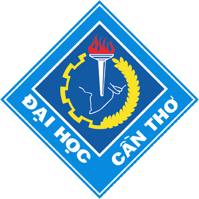

# Nhận Dạng Hình Ảnh và Một Số Ứng Dụng Trong Y Học

## Thông tin tác giả

Võ Văn Tài:      Giáo viên hướng dẫn

Trần Nam Hưng:   chủ nhiệm đề tài

Lý Ngọc Thanh:   thành viên

Khoa Khoa học Tự nhiên, Đại học Cần Thơ

E-mail: <hungb1906052@student.ctu.edu.vn>

## Các gói lệnh yêu cầu

## 

Nếu bạn gặp bất cứ lỗi hoặc cho rằng nội dung có thể được cải thiện, bạn có thể tạo một issue [tại đây](https://github.com/hungtrannam/image_classification/issues).
